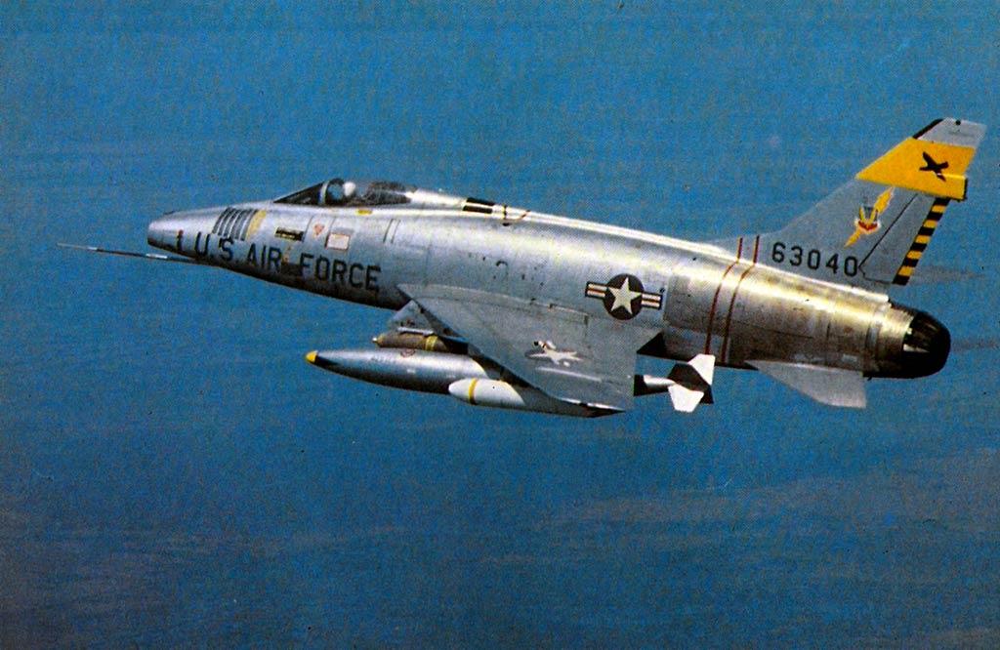
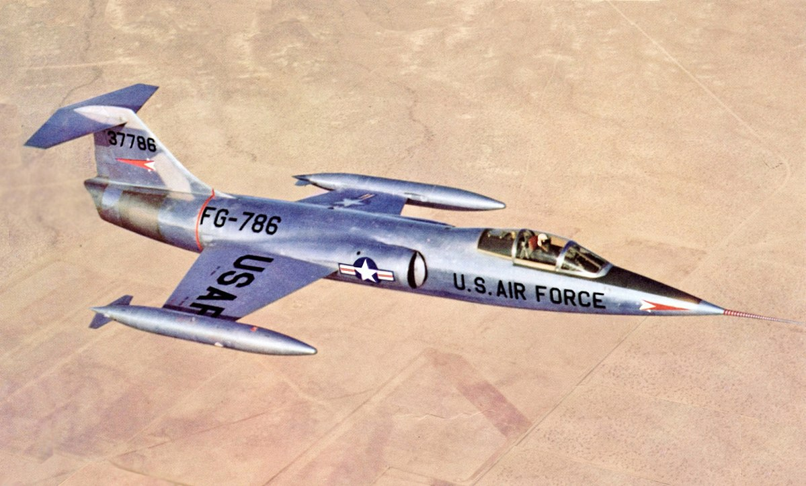
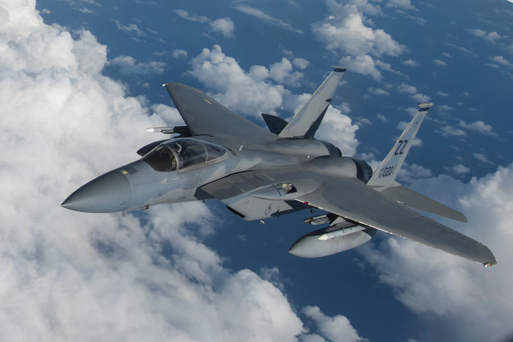

# Introduction

The Cold War was a revolutionary era for aviation, driven by the rivalry between the United States and Soviet Union vying for technological and strategic dominance. This period redefined the roles of aircraft as they entered the new realm of deterrence, intelligence, and global influence. The skies became a battleground for ideological and technological supremacy, with aircraft symbolizing a nation’s power and progress. Supersonic flight emerged as one of the era’s most groundbreaking advancements. Furthurmore, advancements in weapon systems allowed for long range and high precision strikes with heat-seeking and radar-guided missiles. The integration of these technologies introduced a new level to aerial engagements. These innovations highlighted the Cold War's nature as a geopolitical struggle and a technological arms race. Cold War aviation laid the groundwork for modern airpower and its role in shaping global politics.

 

  

 

# United States

Placeholder

 

<h4 class="center-header">Fighters</h4>

<a href="/cold-war/north-american-f-86-sabre/" class="plane-box">
    

      
    

    

      <strong>North American F-86 Sabre &rarr;</strong>
    

  </a>
  <a href="/cold-war/north-american-f-100-super-sabre/" class="plane-box">
    

      
    

    

      <strong>North American F-100 Super Sabre &rarr;</strong>
    

  </a>
  <a href="/cold-war/lockheed-f-104-starfighter/" class="plane-box">
    

      
    

    

      <strong>Lockheed F-104 Starfighter &rarr;</strong>
    

  </a>
  <a href="/cold-war/republic-f-104-thunderchief/" class="plane-box">
    

      
    

    

      <strong>Republic F-105 Thunderchief &rarr;</strong>
    

  </a>
  <a href="/cold-war/mcdonnel-f-4-phantom/" class="plane-box">
    

      
    

    

      <strong>McDonnell F-4 Phantom II &rarr;</strong>
    

  </a>
  <a href="/cold-war/general-dynamics-f-111-aardvark/" class="plane-box">
    

      
    

    

      <strong>General Dynamics F-111 Aardvark &rarr;</strong>
    

  </a>
  <a href="/cold-war/grumman-f-14-tomcat/" class="plane-box">
    

      
    

    

      <strong>Grumman F-14 Tomcat &rarr;</strong>
    

  </a>
  <a href="/cold-war/mcdonnel-douglas-f-15-eagle/" class="plane-box">
    

      
    

    

      <strong>McDonnell Douglas F-15 Eagle &rarr;</strong>
    

  </a>
  <a href="/cold-war/general-dynamics-f-16-fighting-falcon/" class="plane-box">
    

      
    

    

      <strong>General Dynamics F-16 Fighting Falcon &rarr;</strong>
    

  </a>
  <a href="/cold-war/mcdonnell-douglas-fa-18-hornet/" class="plane-box">
    

      
    

    

      <strong>McDonnell Douglas F/A-18 Hornet &rarr;</strong>
    

  </a>

 

<h4 class="center-header">Bombers</h4>

<a href="/cold-war/lockheed-p-38-lightning/" class="plane-box">
    

      
    

    

      <strong>Convair B-36 Peacemaker &rarr;</strong>
    

  </a>
  <a href="/cold-war/north-american-p-51-mustang/" class="plane-box">
    

      
    

    

      <strong>Boeing B-50 Superfortress &rarr;</strong>
    

  </a>
  <a href="/cold-war/republic-p-47-thunderbolt/" class="plane-box">
    

      
    

    

      <strong>Boeing B-47 Stratojet &rarr;</strong>
    

  </a>
  <a href="/cold-war/northrop-p-61-black-widow/" class="plane-box">
    

      
    

    

      <strong>Boeing B-52 Stratofortress &rarr;</strong>
    

  </a>
  <a href="/cold-war/northrop-p-61-black-widow/" class="plane-box">
    

      
    

    

      <strong>Convair B-58 Hustler &rarr;</strong>
    

  </a>
  <a href="/cold-war/northrop-p-61-black-widow/" class="plane-box">
    

      
    

    

      <strong>Northrop Grumman B-2 Spirit &rarr;</strong>
    

  </a>

 

<h4 class="center-header">Reconnaissance / Surveillance</h4>

<a href="/cold-war/lockheed-p-38-lightning/" class="plane-box">
    

      
    

    

      <strong>Lockheed U-2 &rarr;</strong>
    

  </a>
  <a href="/cold-war/north-american-p-51-mustang/" class="plane-box">
    

      
    

    

      <strong>Lockheed SR-71 Blackbird &rarr;</strong>
    

  </a>
  <a href="/cold-war/republic-p-47-thunderbolt/" class="plane-box">
    

      
    

    

      <strong>Lockheed EC-121 Warning Star &rarr;</strong>
    

  </a>
  <a href="/cold-war/northrop-p-61-black-widow/" class="plane-box">
    

      
    

    

      <strong>Boeing E-3 Sentry &rarr;</strong>
    

  </a>

 

<h4 class="center-header">Transport</h4>

<a href="/cold-war/lockheed-p-38-lightning/" class="plane-box">
    

      
    

    

      <strong>Lockheed C-130 Hercules &rarr;</strong>
    

  </a>
  <a href="/cold-war/north-american-p-51-mustang/" class="plane-box">
    

      
    

    

      <strong>Lockheed C-141 Starlifter &rarr;</strong>
    

  </a>
  <a href="/cold-war/republic-p-47-thunderbolt/" class="plane-box">
    

      
    

    

      <strong>Lockheed C-5 Galaxy &rarr;</strong>
    

  </a>

 

 

# Soviet Union

# United Kingdom

# France
