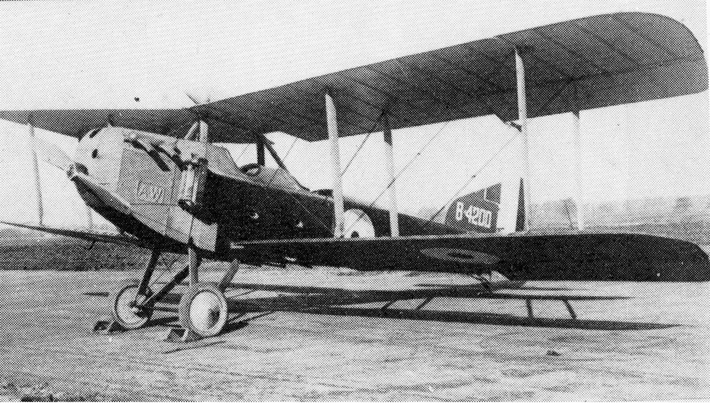
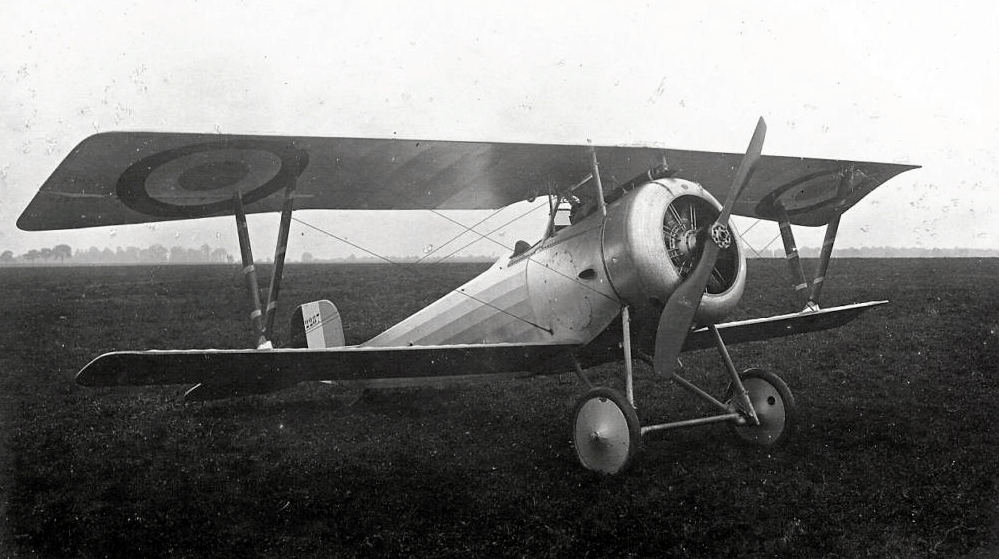
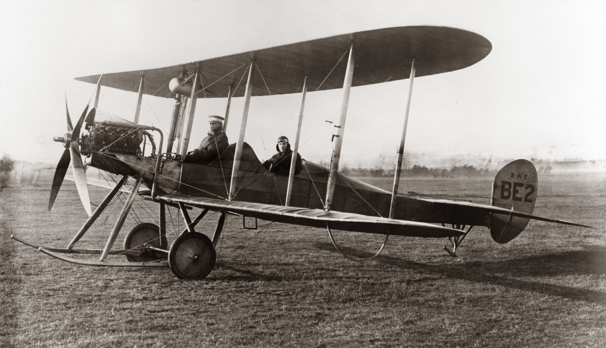
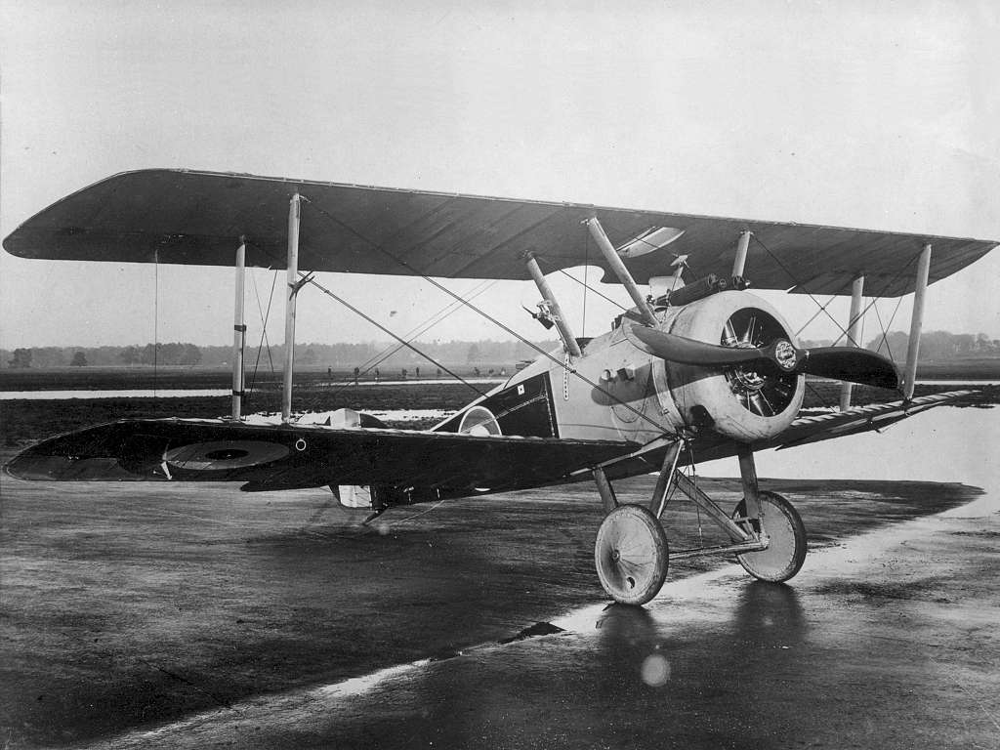
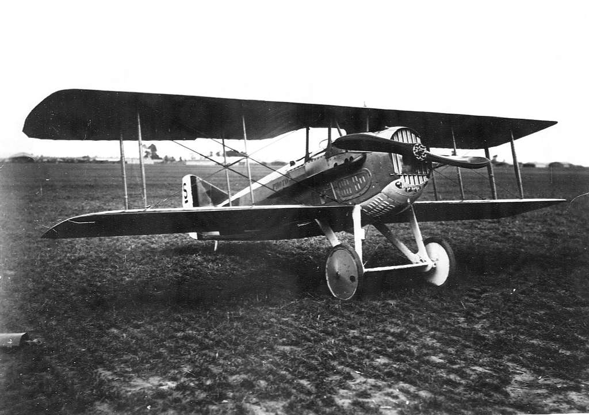
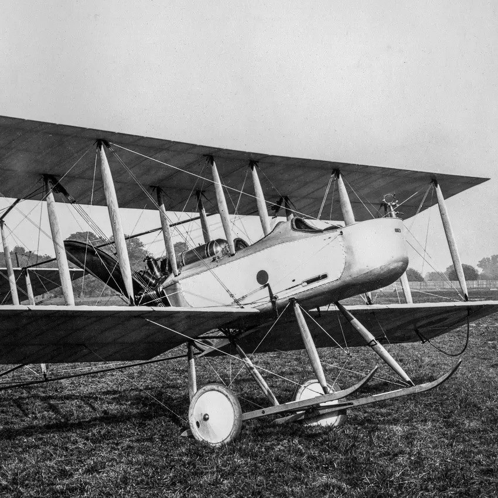

# About

This website serves as a comprehensive guide to various aircraft throughout history, including detailed information and specifications of each aircraft.

 

  

 

# Author

Lorem ipsum odor amet, consectetuer adipiscing elit. Nullam praesent porttitor praesent luctus metus vel facilisis mus. Nisi lectus neque lacinia neque rhoncus vulputate. Semper laoreet ultricies malesuada torquent viverra condimentum eros praesent. Suscipit ultricies erat vehicula curabitur lacus finibus. Conubia molestie litora, ipsum proin amet tellus aliquam. Lobortis mattis lacus primis adipiscing phasellus lacinia ridiculus consectetur. Mi phasellus nullam est justo quis, vel mollis leo. Nisl quam tempor lectus lobortis facilisi blandit.

 

# Full List

  <a href="/website/world-war-i/albatros-di/" class="plane-box">
    

      
    

    

      <strong>Albatros D.I &rarr;</strong>
    

  </a>
  <a href="/website/world-war-i/albatros-dv/" class="plane-box">
    

      
    

    

      <strong>Albatros D.V &rarr;</strong>
    

  </a>
  <a href="/website/world-war-i/armstrong-whitworth-fk8/" class="plane-box">
    

      
    

    

      <strong>Armstrong Whitworth F.K.8 &rarr;</strong>
    

  </a>
  <a href="/website/world-war-i/bristol-f2/" class="plane-box">
    

      
    

    

      <strong>Bristol F.2 &rarr;</strong>
    

  </a>
  <a href="/website/world-war-i/fokker-dri/" class="plane-box">
    

      
    

    

      <strong>Fokker Dr.I &rarr;</strong>
    

  </a>
  <a href="/website/world-war-i/fokker-dvii/" class="plane-box">
    

      
    

    

      <strong>Fokker D.VII &rarr;</strong>
    

  </a>
  <a href="/website/world-war-i/fokker-dviii/" class="plane-box">
    

      
    

    

      <strong>Fokker D.VIII &rarr;</strong>
    

  </a>
  <a href="/website/world-war-i/fokker-eindecker/" class="plane-box">
    

      
    

    

      <strong>Fokker Eindecker &rarr;</strong>
    

  </a>
  <a href="/website/world-war-i/halberstadt-dii/" class="plane-box">
    

      
    

    

      <strong>Halberstadt D.II &rarr;</strong>
    

  </a>
  <a href="/website/world-war-i/nieuport-17/" class="plane-box">
    

      
    

    

      <strong>Nieuport 17 &rarr;</strong>
    

  </a>
  <a href="/website/world-war-i/royal-aircraft-factory-be2/" class="plane-box">
    

      
    

    

      <strong>Royal Aircraft Factory B.E.2 &rarr;</strong>
    

  </a>
  <a href="/website/world-war-i/royal-aircraft-factory-se5/" class="plane-box">
    

      
    

    

      <strong>Royal Aircraft Factory S.E.5 &rarr;</strong>
    

  </a>
  <a href="/website/world-war-i/sopwith-camel/" class="plane-box">
    

      
    

    

      <strong>Sopwith Camel &rarr;</strong>
    

  </a>
  <a href="/website/world-war-i/spad-svii/" class="plane-box">
    

      
    

    

      <strong>SPAD S.VII &rarr;</strong>
    

  </a>
  <a href="/website/world-war-i/spad-sxiii/" class="plane-box">
    

      
    

    

      <strong>SPAD S.XIII &rarr;</strong>
    

  </a>
  <a href="/website/world-war-i/vickers-fb5/" class="plane-box">
    

      
    

    

      <strong>Vickers F.B.5 &rarr;</strong>
    

  </a>

