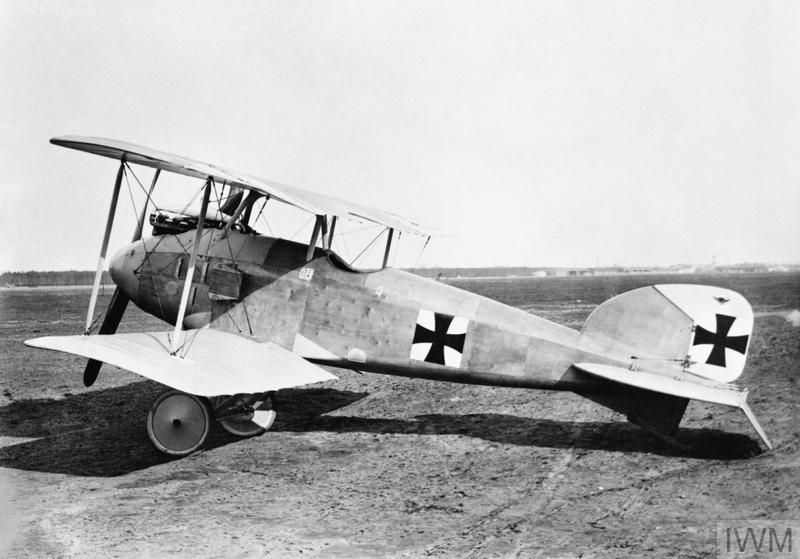
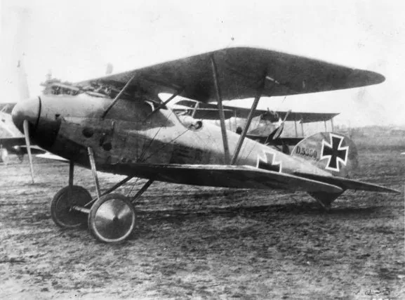

# Introduction

World War I marked the dawn of aerial warfare, a pivotal moment in history that transformed the skies into a new battlefield. At the outbreak of the war, airplanes were a novel invention, and were primarily used for reconnaissance and gathering intelligence on enemy positions. However, as the conflict progressed, warplanes quickly evolved into critical tools for combat. As pilots began mounting machine guns on their airframes and hand-dropping explosives on enemy combatants below, dogfights and bombing runs became defining features of the air war, adding a new dimension to the battlefield. These early planes were marvels of ingenuity, crafted from wood and fabric but equipped with cutting-edge technologies of their time, such as synchronized machine guns that could fire through the propeller arc. Despite their simplicity by modern standards, these aircraft set the foundation for the warplanes that followed. 

 

  

 

# United Kingdom

In 1912, the Royal Flying Corps (RFC) was founded with a military and naval wing, along with a central flying school. The RFC's early years were spent testing aircraft for artillery spotting and aerial photography. At the outbreak of the First World War in 1914, the RFC comprised of only three squadrons with about 30 serviceable aircraft, but quickly expanded. The British aircraft industry, initially behind Germany and France in design and production, rapidly caught up and produced some of the most iconic planes of the conflict. At end of the end, the Royal Flying Corps evolved into the Royal Air Force, the world's first independant air force.

 

<h3 class="center-header">Fighter</h3>

  <a href="/world-war-i/royal-aircraft-factory-be2/" class="plane-box">
    

      
    

    

      <strong>Royal Aircraft Factory B.E.2 &rarr;</strong>
    

  </a>
  <a href="/world-war-i/vickers-fb5/" class="plane-box">
    

      
    

    

      <strong>Vickers F.B.5 &rarr;</strong>
    

  </a>
  <a href="/world-war-i/armstrong-whitworth-fk8/" class="plane-box">
    

      
    

    

      <strong>Armstrong Whitworth F.K.8 &rarr;</strong>
    

  </a>
  <a href="/world-war-i/bristol-f2/" class="plane-box">
    

      
    

    

      <strong>Bristol F.2 &rarr;</strong>
    

  </a>
  <a href="/world-war-i/royal-aircraft-factory-se5/" class="plane-box">
    

      
    

    

      <strong>Royal Aircraft Factory S.E.5 &rarr;</strong>
    

  </a>
  <a href="/world-war-i/sopwith-camel/" class="plane-box">
    

      
    

    

      <strong>Sopwith Camel &rarr;</strong>
    

  </a>

 

 

# Germany

The Luftstreitkräfte (Imperial German Army Air Service) founded in 1910, quickly became one of the most formidable air forces of World War I. Germany employed a range of highly technological aircraft, along with Zeppelin airships which participated in bombing campaigns. The most succesful ace pilot of the conflict, Manfred "The Red Baron" von Richthofen, who flew the iconic Fokker Dr.I and became a symbol of German aerial prowess.

 

<h3 class="center-header">Fighter</h3>

  <a href="/world-war-i/fokker-eindecker/" class="plane-box">
    

      
    

    

      <strong>Fokker Eindecker &rarr;</strong>
    

  </a>
  <a href="/world-war-i/halberstadt-dii/" class="plane-box">
    

      
    

    

      <strong>Halberstadt D.II &rarr;</strong>
    

  </a>
  <a href="/world-war-i/albatros-di/" class="plane-box">
    

      
    

    

      <strong>Albatros D.I &rarr;</strong>
    

  </a>
  <a href="/world-war-i/albatros-dv/" class="plane-box">
    

      
    

    

      <strong>Albatros D.V &rarr;</strong>
    

  </a>
  <a href="/world-war-i/fokker-dri/" class="plane-box">
    

      
    

    

      <strong>Fokker Dr.I &rarr;</strong>
    

  </a>
  <a href="/world-war-i/fokker-dvii/" class="plane-box">
    

      
    

    

      <strong>Fokker D.VII &rarr;</strong>
    

  </a>
  <a href="/world-war-i/fokker-dviii/" class="plane-box">
    

      
    

    

      <strong>Fokker D.VIII &rarr;</strong>
    

  </a>

 

 

# France

France was one of the first nations to recognize the military potential of aircraft. In 1910, the French established an air unit of the army, known as the Aéronautique Militaire. By the start of the war, the Aéronautique Militaire already had around 140 aircraft, which was more than any other nation at the time. The service rapidly grew in size, technology, and strategic importance throughout the war.By the end of World War I, the Service Aéronautique had grown to over 3,600 aircraft and 78,000 personnel.

 

<h3 class="center-header">Fighter</h3>

  <a href="/world-war-i/nieuport-17/" class="plane-box">
    

      
    

    

      <strong>Nieuport 17 &rarr;</strong>
    

  </a>
  <a href="/world-war-i/spad-svii/" class="plane-box">
    

      
    

    

      <strong>SPAD S.VII &rarr;</strong>
    

  </a>
  <a href="/world-war-i/spad-sxiii/" class="plane-box">
    

      
    

    

      <strong>SPAD S.XIII &rarr;</strong>
    

  </a>

 

 