# Introduction

After the First World War, the potential of aircraft in warfare was fully realized. Many nations began prioritising the research and development of new state-of-the-art aircraft, and the world saw a leap in aviation technology and strategy, firmly establishing aircraft as decisive tools of warfare. During World War II, airplanes became integral to every aspect of the war effort, ranging from large air superiority battles to devastating close air support to massive bombing campaigns. Combatants began mass-producing aircraft with remarkable advances in speed, maneuverability, range, and firepower. The war also saw the introduction of revolutionary technologies, including radar and jet propulsion, setting the stage for a new era of aviation.

 

  

 

# United States

American planes in the Second World War were built for range and power. U.S. aircraft often emphasized long-distance capability, heavy armament, and durability — fitting for a nation fighting a two-ocean war. Fighters like the P-51 Mustang combined speed and range, escorting bombers such as the B-17 Flying Fortress and B-29 Superfortress which could absorb punishment and still bring crews home. Naval aviation also flourished, with rugged carrier-based planes like the F6F Hellcat dominating the Pacific. U.S. designs reflected industrial might and a doctrine of overwhelming air superiority.

 

<h4 class="center-header">Fighters</h4>

<a href="/world-war-ii/lockheed-p-38-lightning/" class="plane-box">
    

      
    

    

      <strong>Lockheed P-38 Lightning &rarr;</strong>
    

  </a>
  <a href="/world-war-ii/north-american-p-51-mustang/" class="plane-box">
    

      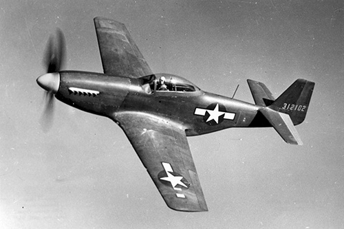
    

    

      <strong>North American P-51 Mustang &rarr;</strong>
    

  </a>
  <a href="/world-war-ii/republic-p-47-thunderbolt/" class="plane-box">
    

      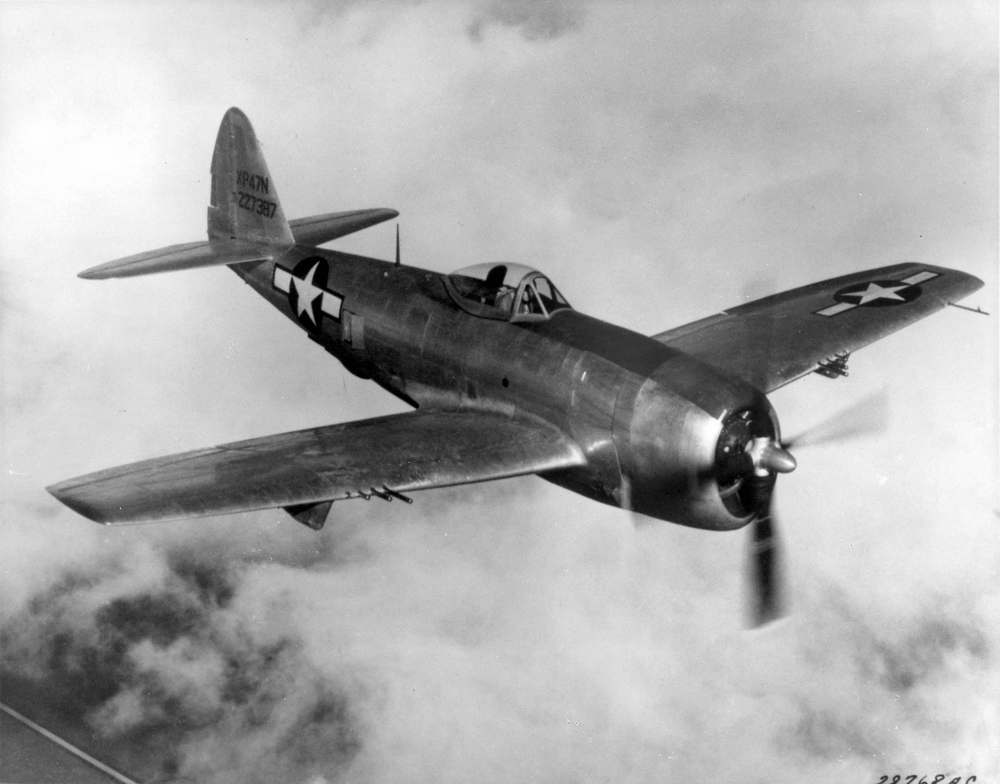
    

    

      <strong>Republic P-47 Thunderbolt &rarr;</strong>
    

  </a>
  <a href="/world-war-ii/northrop-p-61-black-widow/" class="plane-box">
    

      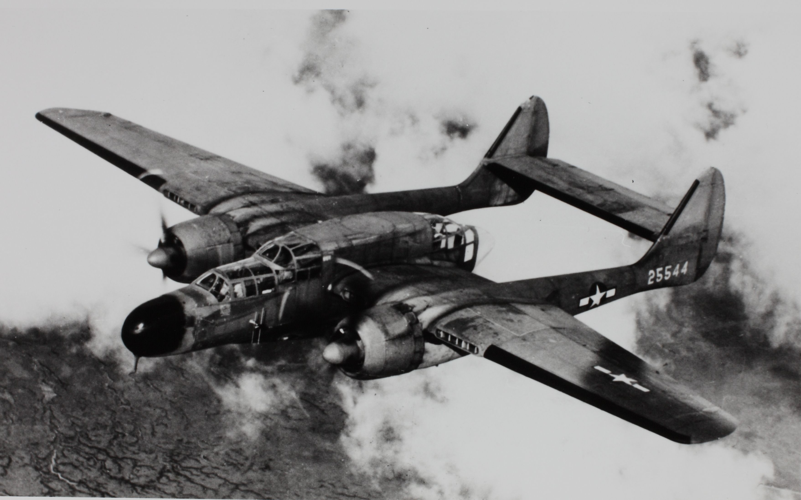
    

    

      <strong>Northrop P-61 Black Widow &rarr;</strong>
    

  </a>

 

<h4 class="center-header">Carrier Fighters</h4>

  <a href="/world-war-ii/grumman-f4f-wildcat/" class="plane-box">
    

      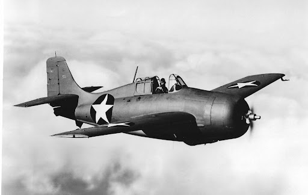
    

    

      <strong>Grumman F4F Wildcat &rarr;</strong>
    

  </a>
  <a href="/world-war-ii/vought-f4u-corsair/" class="plane-box">
    

      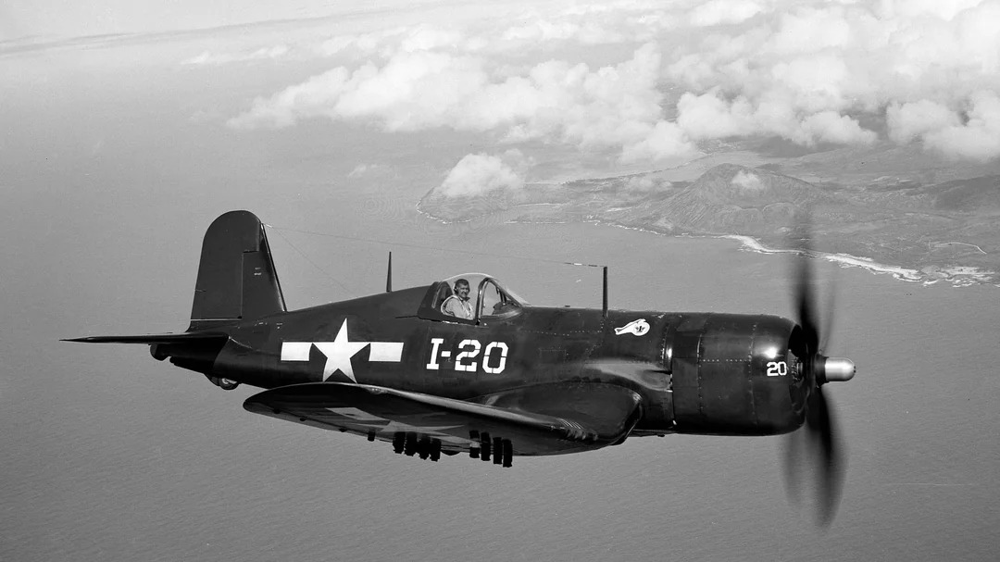
    

    

      <strong>Vought F4U Corsair &rarr;</strong>
    

  </a>
  <a href="/world-war-ii/grumman-f6f-hellcat/" class="plane-box">
    

      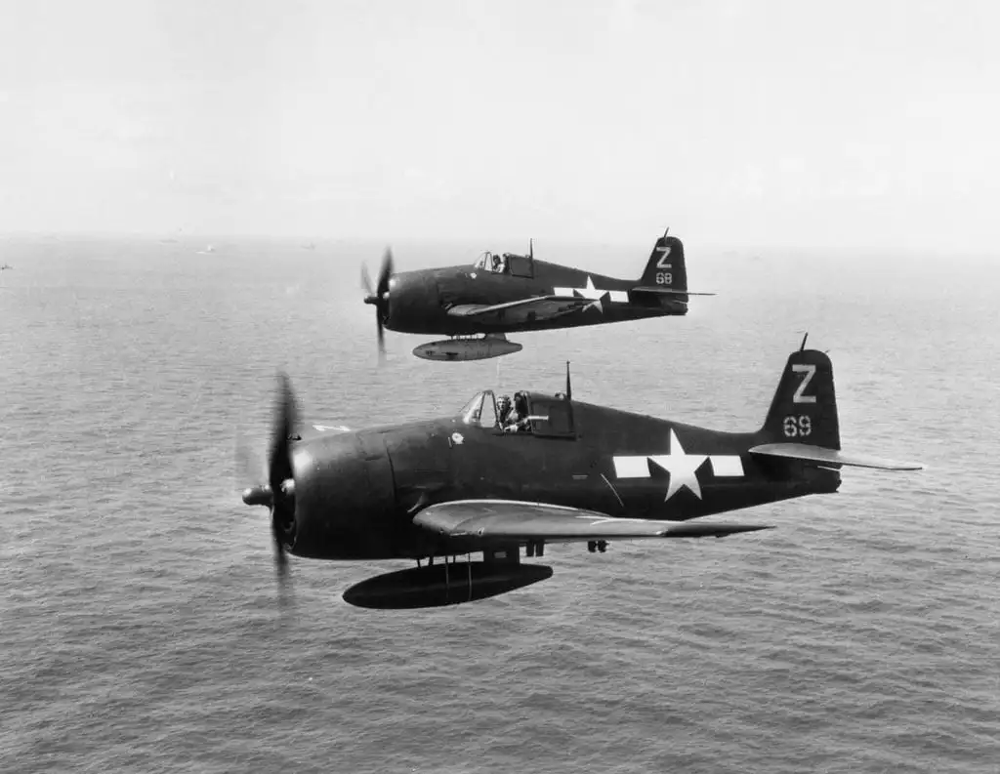
    

    

      <strong>Grumman F6F Hellcat &rarr;</strong>
    

  </a>

 

<h4 class="center-header">Bombers</h4>

  <a href="/world-war-ii/boeing-b-17-flying-fortress/" class="plane-box">
    

      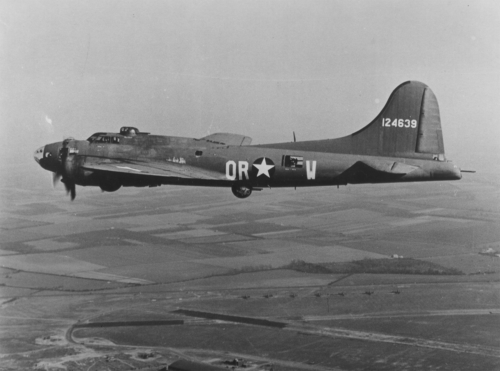
    

    

      <strong>Boeing B-17 Flying Fortress &rarr;</strong>
    

  </a>
  <a href="/world-war-ii/north-american-b-25-mitchell/" class="plane-box">
    

      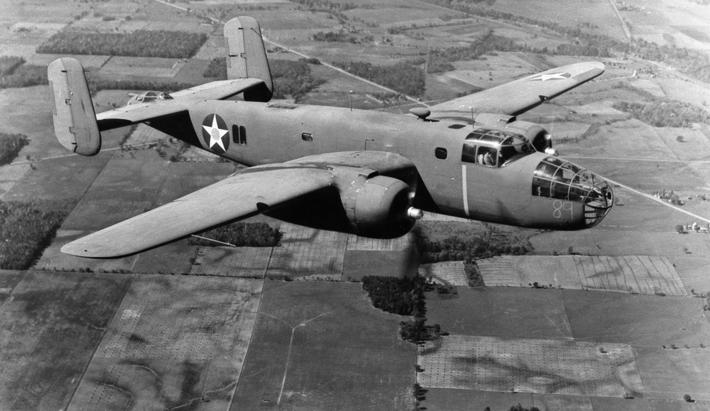
    

    

      <strong>North American B-25 Mitchell &rarr;</strong>
    

  </a>
  <a href="/world-war-ii/consolidated-b-24-liberator/" class="plane-box">
    

      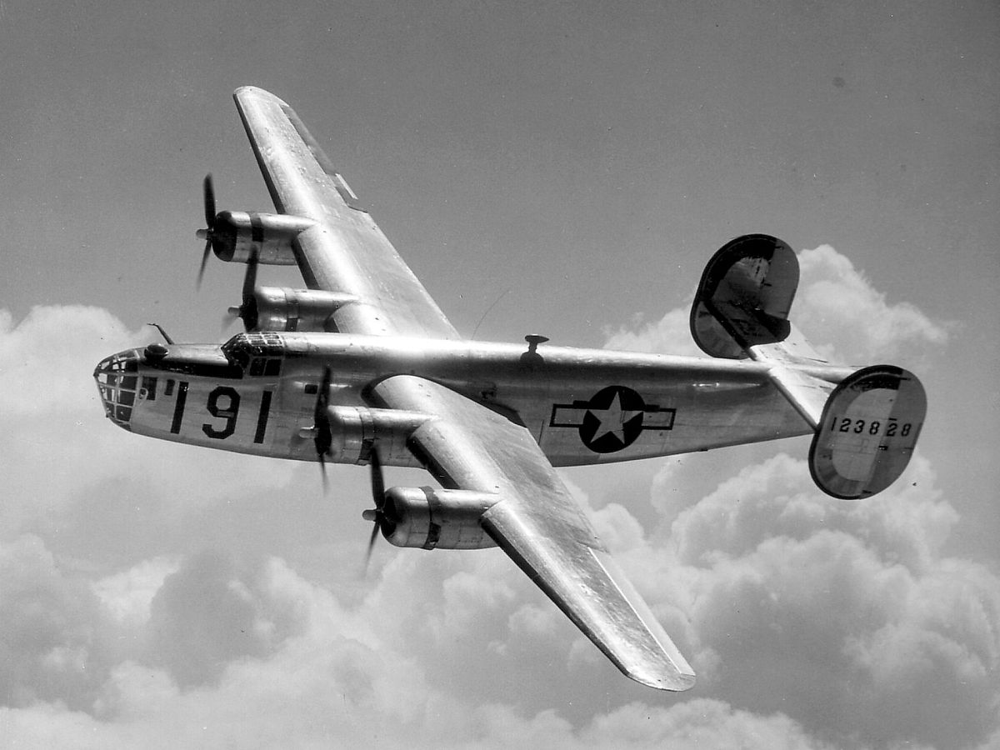
    

    

      <strong>Consolidated B-24 Liberator &rarr;</strong>
    

  </a>
  <a href="/world-war-ii/boeing-b-29-superfortress/" class="plane-box">
    

      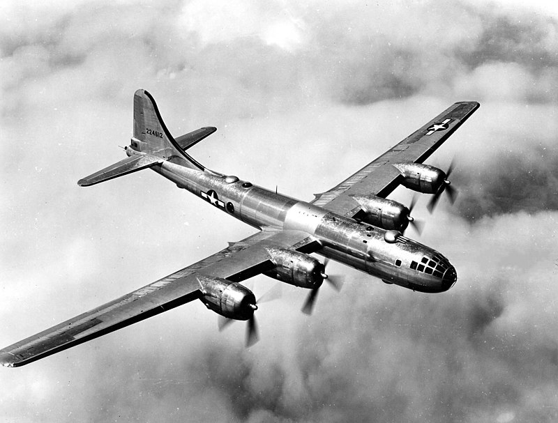
    

    

      <strong>Boeing B-29 Superfortress &rarr;</strong>
    

  </a>

 

 

# United Kingdom

British aircraft reflected a balance of agility, adaptability, and specialized roles. The Spitfire stood out for its sleek elliptical wings and dogfighting finesse, while the Hurricane — though more conventional — was sturdy and easy to repair. The RAF emphasized night combat, with British bombers conducting night raids into Germany throughout the war. Britain’s aircraft were often elegant yet practical, tailored to an island nation defending its skies and hitting back hard.

 

<h4 class="center-header">Fighters</h4>

<a href="/world-war-ii/gloster-gladiator/" class="plane-box">
    

      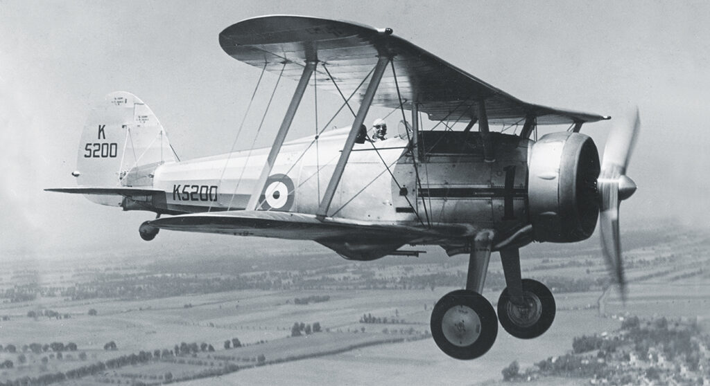
    

    

      <strong>Gloster Gladiator &rarr;</strong>
    

  </a>
  <a href="/world-war-ii/hawker-hurricane/" class="plane-box">
    

      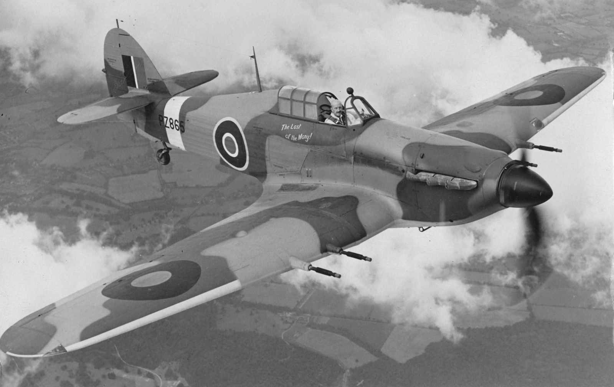
    

    

      <strong>Hawker Hurricane &rarr;</strong>
    

  </a>
  <a href="/world-war-ii/supermarine-spitfire/" class="plane-box">
    

      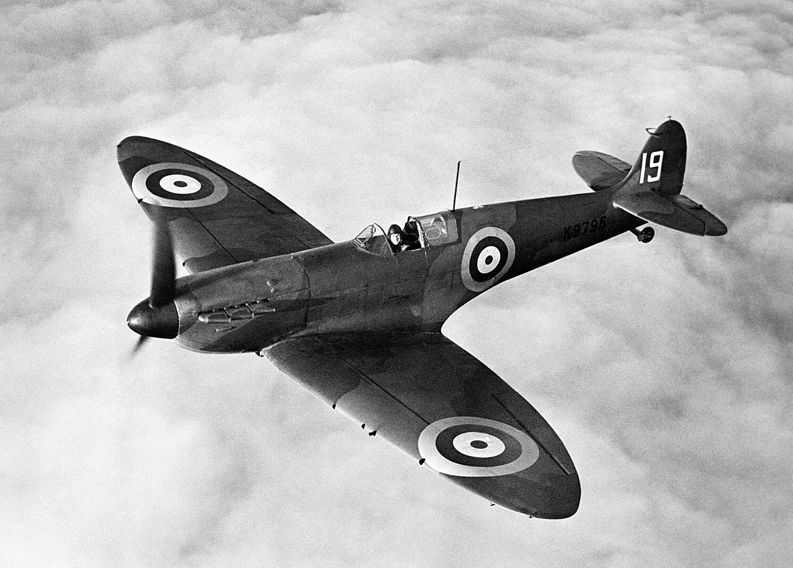
    

    

      <strong>Supermarine Spitfire &rarr;</strong>
    

  </a>

 

<h4 class="center-header">Bombers</h4>

<a href="/world-war-ii/short-stirling/" class="plane-box">
    

      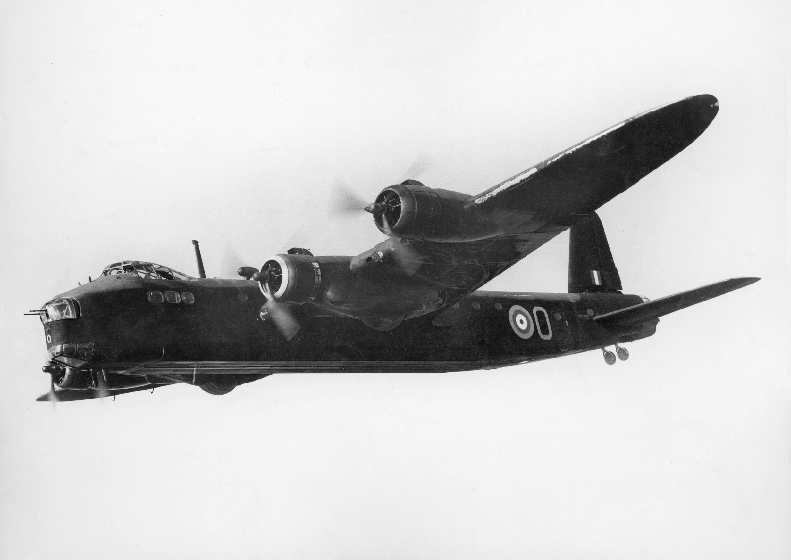
    

    

      <strong>Short Stirling &rarr;</strong>
    

  </a>
  <a href="/world-war-ii/handley-page-halifax/" class="plane-box">
    

      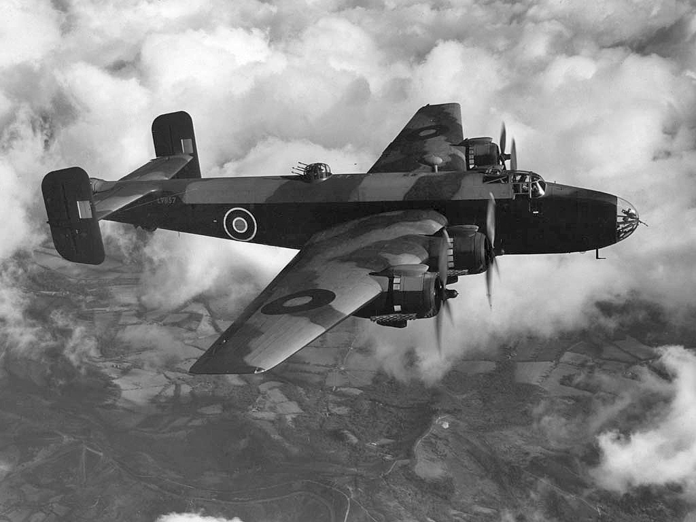
    

    

      <strong>Handley Page Halifax &rarr;</strong>
    

  </a>
  <a href="/world-war-ii/avro-lancaster/" class="plane-box">
    

      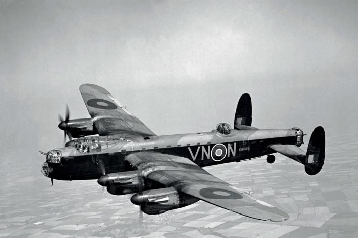
    

    

      <strong>Avro Lancaster &rarr;</strong>
    

  </a>

 

 

# Germany

German aircraft design combined engineering precision with aggressive tactics, aiming for fast strikes and tight coordination with ground forces. The Bf 109 was a nimble, high-performance fighter, while the infamous Ju 87 Stuka was a terrifying dive bomber. German bombers like the He 111 and Do 17 were built for Blitzkrieg support—quick, coordinated attacks rather than sustained strategic bombing. Later-war designs included cutting-edge jets like the Me 262, showcasing German innovation despite production struggles. Efficiency and effectiveness in tactical roles defined the Luftwaffe’s style.

 

<h4 class="center-header">Fighters</h4>

<a href="/world-war-ii/messerschmitt-bf-109/" class="plane-box">
    

      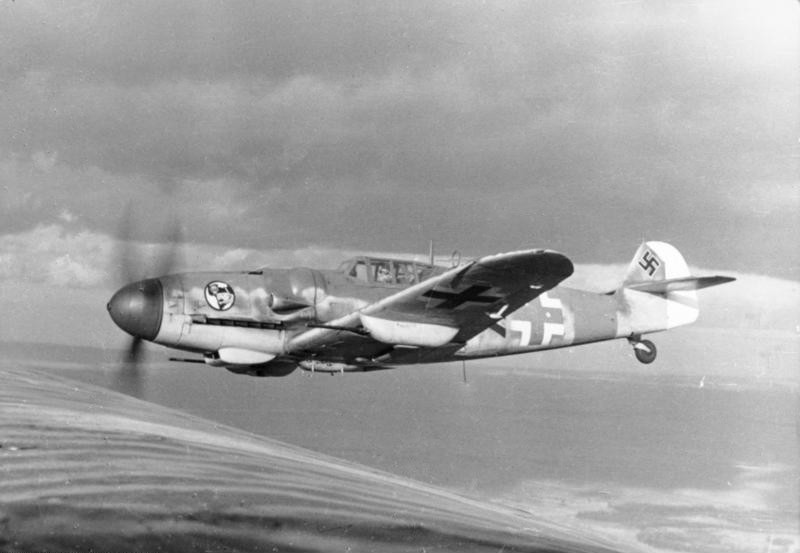
    

    

      <strong>Messerschmitt Bf 109 &rarr;</strong>
    

  </a>
  <a href="/world-war-ii/focke-wulf-fw-190/" class="plane-box">
    

      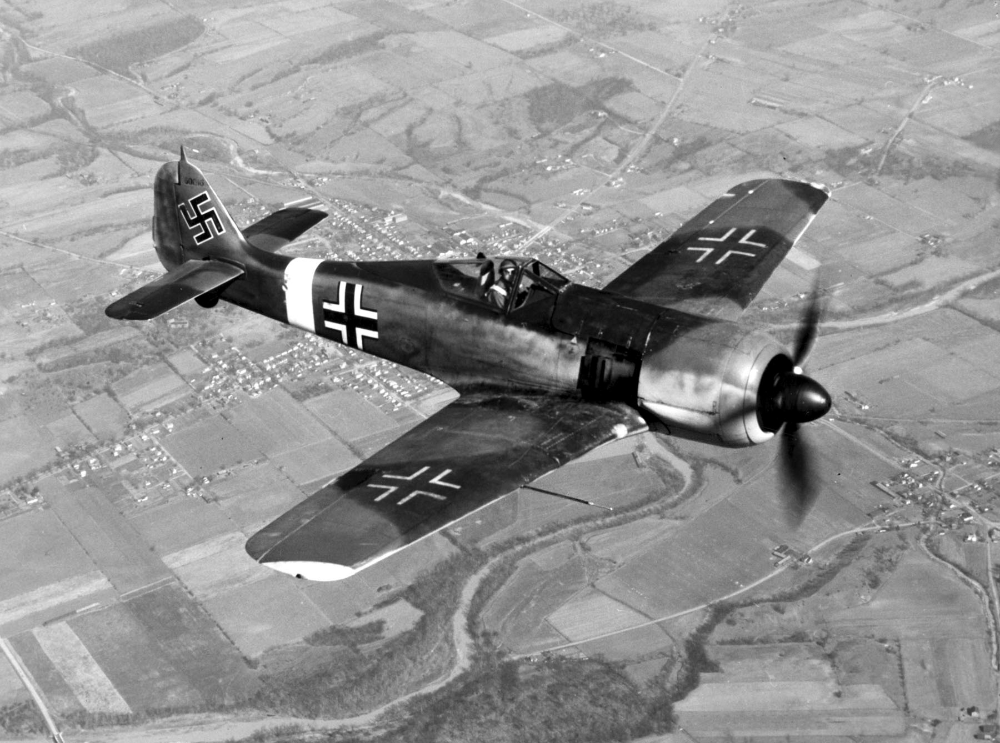
    

    

      <strong>Focke-Wulf Fw 190 &rarr;</strong>
    

  </a>
  <a href="/world-war-ii/messerschmitt-me-262/" class="plane-box">
    

      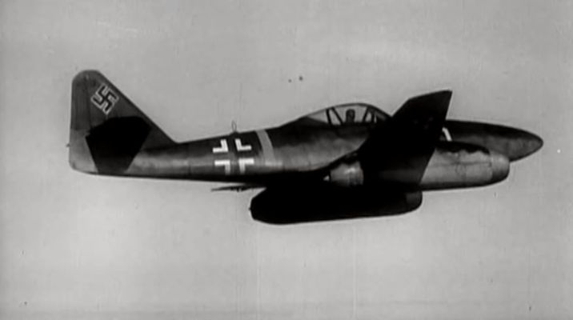
    

    

      <strong>Messerschmitt Me 262 &rarr;</strong>
    

  </a>

 

<h4 class="center-header">Bombers</h4>

<a href="/world-war-ii/heinkel-he-111/" class="plane-box">
    

      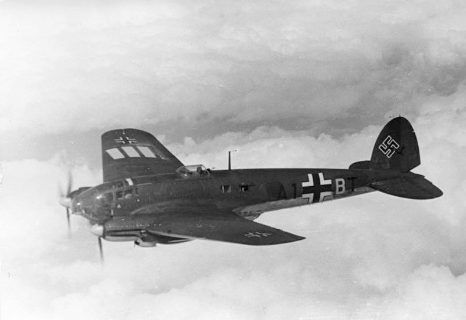
    

    

      <strong>Heinkel He 111 &rarr;</strong>
    

  </a>
  <a href="/world-war-ii/dornier-do-17/" class="plane-box">
    

      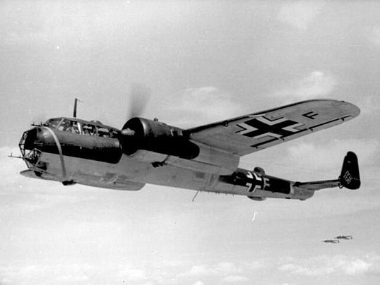
    

    

      <strong>Dornier Do 17 &rarr;</strong>
    

  </a>
  <a href="/world-war-ii/junkers-ju-87/" class="plane-box">
    

      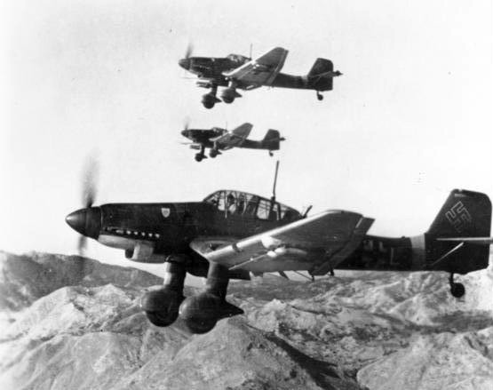
    

    

      <strong>Junkers Ju 87 &rarr;</strong>
    

  </a>
  <a href="/world-war-ii/junkers-ju-88/" class="plane-box">
    

      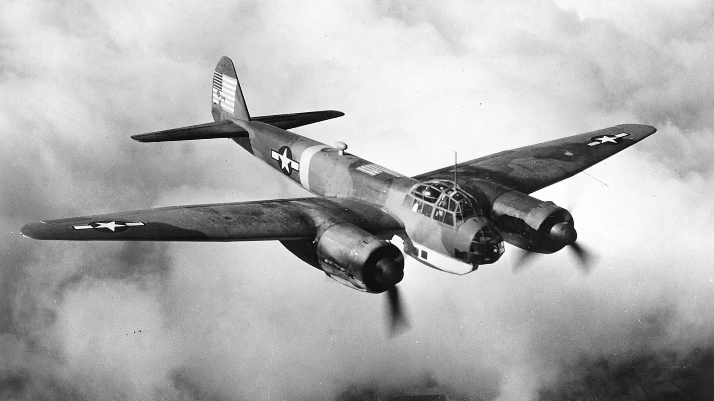
    

    

      <strong>Junkers Ju 88 &rarr;</strong>
    

  </a>

 

 

# Soviet Union

Soviet planes were built to be rugged and fast to produce. The USSR prioritized simplicity, survivability, and mass production, leading to fighters like the Yak-3 and La-5, which were nimble, aggressive, and excelled at low altitudes—perfect for the Eastern Front. Bombers like the Pe-2 were versatile, and aircraft often doubled roles out of necessity. Soviet aviation emphasized function over form: if a plane could fly from a rough field and take a beating, it was good enough.

 

<h4 class="center-header">Fighters</h4>

<a href="/world-war-ii/mikoyan-gurevich-mig-3/" class="plane-box">
    

      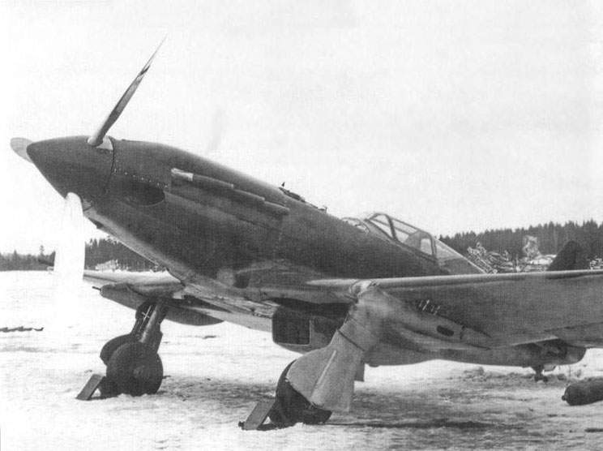
    

    

      <strong>Mikoyan-Gurevich MiG-3 &rarr;</strong>
    

  </a>
  <a href="/world-war-ii/lavochkin-la-5/" class="plane-box">
    

      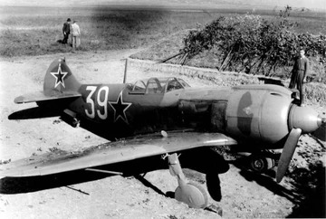
    

    

      <strong>Lavochkin La-5 &rarr;</strong>
    

  </a>
  <a href="/world-war-ii/yakovlev-yak-3/" class="plane-box">
    

      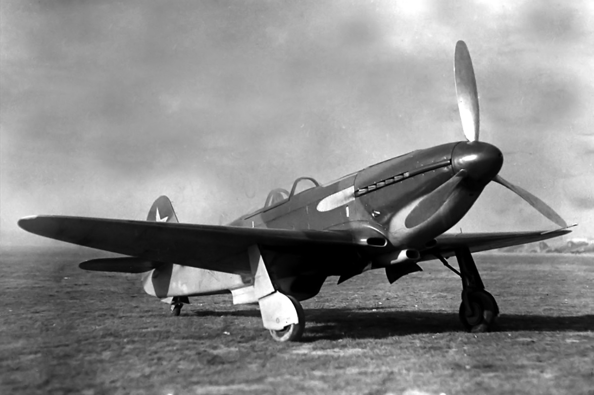
    

    

      <strong>Yakovlev Yak-3 &rarr;</strong>
    

  </a>

 

<h4 class="center-header">Bombers</h4>

<a href="/world-war-ii/ilyushin-il-2/" class="plane-box">
    

      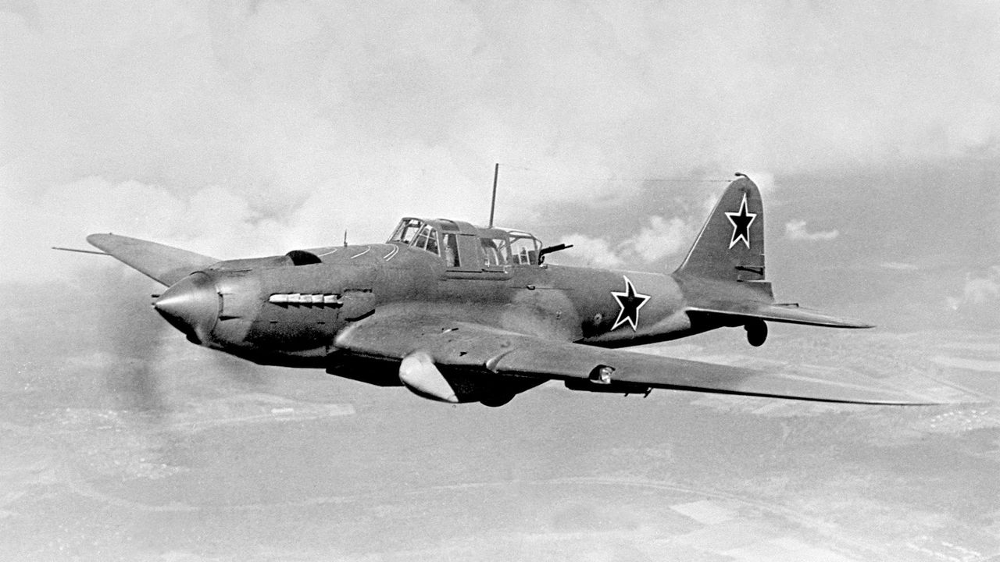
    

    

      <strong>Ilyushin Il-2 &rarr;</strong>
    

  </a>
  <a href="/world-war-ii/petlyakov-pe-2/" class="plane-box">
    

      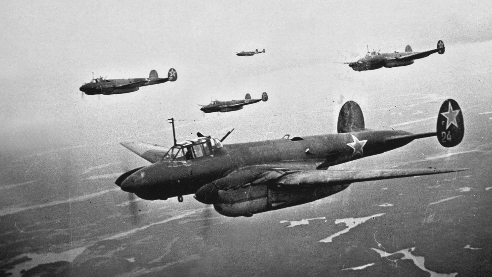
    

    

      <strong>Petlyakov Pe-2 &rarr;</strong>
    

  </a>
  <a href="/world-war-ii/ilyushin-il-4/" class="plane-box">
    

      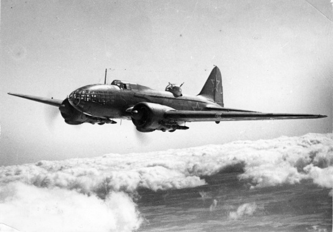
    

    

      <strong>Ilyushin Il-4 &rarr;</strong>
    

  </a>

 

 

# Japan

Japanese aircraft reflected a philosophy of lightness, maneuverability, and long range, often at the cost of armor and self-sealing fuel tanks. The Mitsubishi A6M epitomized this: incredibly agile and deadly in the early war, but increasingly vulnerable as Allied planes got tougher. Japanese design favored offensive reach and pilot skill over protection, which worked well early but proved costly later. Their aircraft were elegant and deadly, but often too lightly built for sustained combat.

 

<h4 class="center-header">Fighters</h4>

<a href="/world-war-ii/mitsubishi-a5m/" class="plane-box">
    

      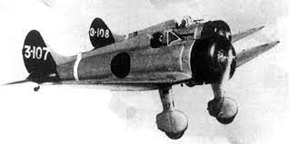
    

    

      <strong>Mitsubishi A5M &rarr;</strong>
    

  </a>
  <a href="/world-war-ii/mitsubishi-a6m/" class="plane-box">
    

      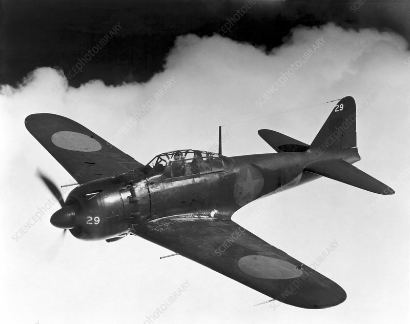
    

    

      <strong>Mitsubishi A6M &rarr;</strong>
    

  </a>
  <a href="/world-war-ii/kawanishi-n1k/" class="plane-box">
    

      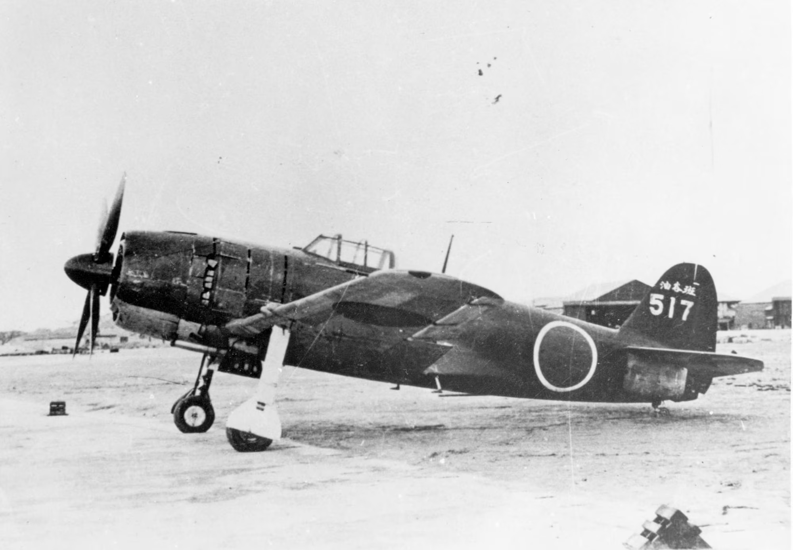
    

    

      <strong>Kawanishi N1K &rarr;</strong>
    

  </a>

 

 