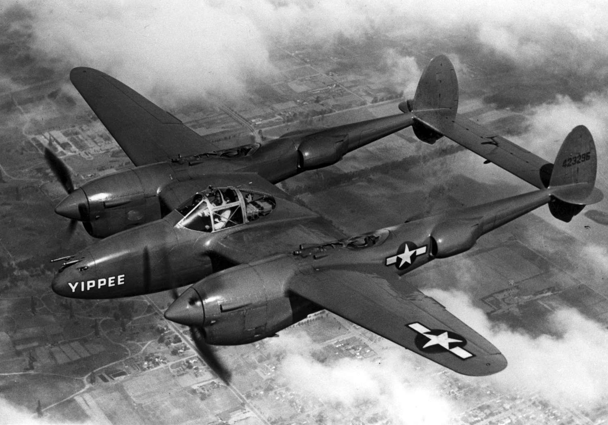

# Introduction

After the First World War, the potential of aircraft in warfare was fully realized. Many nations began prioritising the research and development of new state-of-the-art aircraft, and the world saw a leap in aviation technology and strategy, firmly establishing aircraft as decisive tools of warfare. During World War II, airplanes became integral to every aspect of the war effort, ranging from large air superiority battles to devastating close air support to massive bombing campaigns. Combatants began mass-producing aircraft with remarkable advances in speed, maneuverability, range, and firepower. The war also saw the introduction of revolutionary technologies, including radar and jet propulsion, setting the stage for a new era of aviation.

 

  

 

# United States
 Before the start of the war the U.S. Army Air Corps had only a few hundred air planes. By the end of the war it was the largest Air Force ever assembled with nearly 80,000 airplanes.

 

<h4 class="center-header">Fighters</h4>

<a href="/website/world-war-ii/lockheed-p-38-lightning/" class="plane-box">
    

      
    

    

      <strong>Lockheed P-38 Lightning &rarr;</strong>
    

  </a>
  <a href="/website/world-war-ii/north-american-p-51-mustang/" class="plane-box">
    

      
    

    

      <strong>North American P-51 Mustang &rarr;</strong>
    

  </a>
  <a href="/website/world-war-ii/republic-p-47-thunderbolt/" class="plane-box">
    

      
    

    

      <strong>Republic P-47 Thunderbolt &rarr;</strong>
    

  </a>
  <a href="/website/world-war-ii/northrop-p-61-black-widow/" class="plane-box">
    

      
    

    

      <strong>Northrop P-61 Black Widow &rarr;</strong>
    

  </a>

 

<h4 class="center-header">Carrier Fighters</h4>

  <a href="/website/world-war-ii/grumman-f4f-wildcat/" class="plane-box">
    

      
    

    

      <strong>Grumman F4F Wildcat &rarr;</strong>
    

  </a>
  <a href="/website/world-war-ii/vought-f4u-corsair/" class="plane-box">
    

      
    

    

      <strong>Vought F4U Corsair &rarr;</strong>
    

  </a>
  <a href="/website/world-war-ii/grumman-f6f-hellcat/" class="plane-box">
    

      
    

    

      <strong>Grumman F6F Hellcat &rarr;</strong>
    

  </a>

 

<h4 class="center-header">Bombers</h4>

  <a href="/website/world-war-ii/boeing-b-17-flying-fortress/" class="plane-box">
    

      
    

    

      <strong>Boeing B-17 &rarr;</strong>
    

  </a>
  <a href="/website/world-war-ii/north-american-b-25-mitchell/" class="plane-box">
    

      
    

    

      <strong>North American B-25 Mitchell &rarr;</strong>
    

  </a>
  <a href="/website/world-war-ii/consolidated-b-24-liberator/" class="plane-box">
    

      
    

    

      <strong>Consolidated B-24 Liberator &rarr;</strong>
    

  </a>
  <a href="/website/world-war-ii/boeing-b-29-superfortress/" class="plane-box">
    

      
    

    

      <strong>Boeing B-29 Superfortress &rarr;</strong>
    

  </a>

 

 

# United Kingdom
Lorem ipsum odor amet, consectetuer adipiscing elit. Tempus hendrerit platea sed dignissim rutrum. Gravida feugiat tempus justo sit velit penatibus. Finibus taciti risus duis fames cras quam velit netus bibendum. Rutrum risus nunc sociosqu adipiscing consequat. In quis aenean libero justo et. Nascetur odio convallis purus phasellus urna ante. Ex condimentum primis bibendum lobortis penatibus senectus litora phasellus.

Proin fames lobortis dolor lacus et hac porta laoreet? Ante habitant lorem mattis; ridiculus bibendum odio habitasse id facilisis. Consectetur felis odio ultricies tellus facilisis netus faucibus massa. Id elementum turpis cursus; ante tellus aenean. Risus vehicula tincidunt, adipiscing nostra auctor et mauris. Hendrerit quisque torquent accumsan ex dictum. Tempus auctor porta ipsum ultricies sapien platea mattis elementum porttitor.

Accumsan non nam faucibus praesent urna imperdiet interdum. Id duis porta dui placerat nisl erat. Cursus neque a nisi consectetur morbi hac. Dolor posuere magna posuere venenatis consequat nisl massa. Nascetur nascetur pulvinar nibh primis condimentum dolor tempor. Consequat curabitur vestibulum habitasse penatibus penatibus. Consequat dictum facilisi per phasellus felis enim torquent hac. Egestas cras donec bibendum molestie eleifend. Facilisi aenean habitant dui nec scelerisque vitae fermentum arcu.

 

 

 

# Germany
Lorem ipsum odor amet, consectetuer adipiscing elit. Tempus hendrerit platea sed dignissim rutrum. Gravida feugiat tempus justo sit velit penatibus. Finibus taciti risus duis fames cras quam velit netus bibendum. Rutrum risus nunc sociosqu adipiscing consequat. In quis aenean libero justo et. Nascetur odio convallis purus phasellus urna ante. Ex condimentum primis bibendum lobortis penatibus senectus litora phasellus.

Proin fames lobortis dolor lacus et hac porta laoreet? Ante habitant lorem mattis; ridiculus bibendum odio habitasse id facilisis. Consectetur felis odio ultricies tellus facilisis netus faucibus massa. Id elementum turpis cursus; ante tellus aenean. Risus vehicula tincidunt, adipiscing nostra auctor et mauris. Hendrerit quisque torquent accumsan ex dictum. Tempus auctor porta ipsum ultricies sapien platea mattis elementum porttitor.

Accumsan non nam faucibus praesent urna imperdiet interdum. Id duis porta dui placerat nisl erat. Cursus neque a nisi consectetur morbi hac. Dolor posuere magna posuere venenatis consequat nisl massa. Nascetur nascetur pulvinar nibh primis condimentum dolor tempor. Consequat curabitur vestibulum habitasse penatibus penatibus. Consequat dictum facilisi per phasellus felis enim torquent hac. Egestas cras donec bibendum molestie eleifend. Facilisi aenean habitant dui nec scelerisque vitae fermentum arcu.

 

 

# Soviet Union
Lorem ipsum odor amet, consectetuer adipiscing elit. Tempus hendrerit platea sed dignissim rutrum. Gravida feugiat tempus justo sit velit penatibus. Finibus taciti risus duis fames cras quam velit netus bibendum. Rutrum risus nunc sociosqu adipiscing consequat. In quis aenean libero justo et. Nascetur odio convallis purus phasellus urna ante. Ex condimentum primis bibendum lobortis penatibus senectus litora phasellus.

Proin fames lobortis dolor lacus et hac porta laoreet? Ante habitant lorem mattis; ridiculus bibendum odio habitasse id facilisis. Consectetur felis odio ultricies tellus facilisis netus faucibus massa. Id elementum turpis cursus; ante tellus aenean. Risus vehicula tincidunt, adipiscing nostra auctor et mauris. Hendrerit quisque torquent accumsan ex dictum. Tempus auctor porta ipsum ultricies sapien platea mattis elementum porttitor.

Accumsan non nam faucibus praesent urna imperdiet interdum. Id duis porta dui placerat nisl erat. Cursus neque a nisi consectetur morbi hac. Dolor posuere magna posuere venenatis consequat nisl massa. Nascetur nascetur pulvinar nibh primis condimentum dolor tempor. Consequat curabitur vestibulum habitasse penatibus penatibus. Consequat dictum facilisi per phasellus felis enim torquent hac. Egestas cras donec bibendum molestie eleifend. Facilisi aenean habitant dui nec scelerisque vitae fermentum arcu.

 

 

# Japan
Lorem ipsum odor amet, consectetuer adipiscing elit. Tempus hendrerit platea sed dignissim rutrum. Gravida feugiat tempus justo sit velit penatibus. Finibus taciti risus duis fames cras quam velit netus bibendum. Rutrum risus nunc sociosqu adipiscing consequat. In quis aenean libero justo et. Nascetur odio convallis purus phasellus urna ante. Ex condimentum primis bibendum lobortis penatibus senectus litora phasellus.

Proin fames lobortis dolor lacus et hac porta laoreet? Ante habitant lorem mattis; ridiculus bibendum odio habitasse id facilisis. Consectetur felis odio ultricies tellus facilisis netus faucibus massa. Id elementum turpis cursus; ante tellus aenean. Risus vehicula tincidunt, adipiscing nostra auctor et mauris. Hendrerit quisque torquent accumsan ex dictum. Tempus auctor porta ipsum ultricies sapien platea mattis elementum porttitor.

Accumsan non nam faucibus praesent urna imperdiet interdum. Id duis porta dui placerat nisl erat. Cursus neque a nisi consectetur morbi hac. Dolor posuere magna posuere venenatis consequat nisl massa. Nascetur nascetur pulvinar nibh primis condimentum dolor tempor. Consequat curabitur vestibulum habitasse penatibus penatibus. Consequat dictum facilisi per phasellus felis enim torquent hac. Egestas cras donec bibendum molestie eleifend. Facilisi aenean habitant dui nec scelerisque vitae fermentum arcu.

 

 